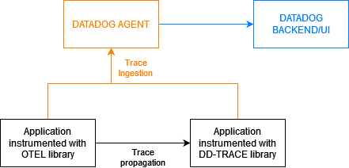

# opentelemetry datadog for go

## Context

Several distributed tracing systems exist to help collect data in service architectures ([Datadog](https://www.datadoghq.com), [Zipkin](https://zipkin.io), [Google Cloud Trace](https://cloud.google.com/trace), ...). Tracing information is generated on each service using a vendor-specific instrumentation library and distributed (using a propagator) between services using a vendor format.

[OpenTelemetry](https://opentelemetry.io) is a collection of tools, APIs, and SDKs, which enable the use of vendor-neutral, loosely coupled instrumentation of your service. It supports some trace distribution with some vendor tracing system (see [here](https://opentelemetry.io/docs/reference/specification/context/api-propagators/#propagators-distribution)) to enable easy integration.

## Why this project

The aim of this project is to allow you to use [OpenTelemetry library](https://github.com/open-telemetry/opentelemetry-go) in your new projects (or to modify an existing one) in service architectures
- using [Datadog](https://www.datadoghq.com) as a server for traces and metrics.
- to enable tracing distribution with other applications using [Datadog tracing library](https://github.com/DataDog/dd-trace-go).

[OpenTelemetry](https://opentelemetry.io) propagators are used to extract and inject context data from and into messages exchanged by applications. The propagator supported by this package is the Datadog
- [Trace Context](propagators/tracecontext/README.md)

## Documentation

OpenTelemetry
- [OpenTelemetry](https://opentelemetry.io)
- [OpenTelemetry data sources](https://opentelemetry.io/docs/concepts/data-sources)
- [OpenTelemetry Registry](https://opentelemetry.io/registry)
- [OpenTelemetry-Go](https://github.com/open-telemetry/opentelemetry-go)
- [OpenTelemetry-Go Contrib](https://github.com/open-telemetry/opentelemetry-go-contrib).

Datadog
- [Datadog](https://www.datadoghq.com)
- [Tracing Go Applications](https://docs.datadoghq.com/tracing/setup/go/)
- [Tracing library](https://github.com/DataDog/dd-trace-go)

## License

This project is licensed under the MIT License - see the [LICENSE.md](LICENSE.md) file for details
